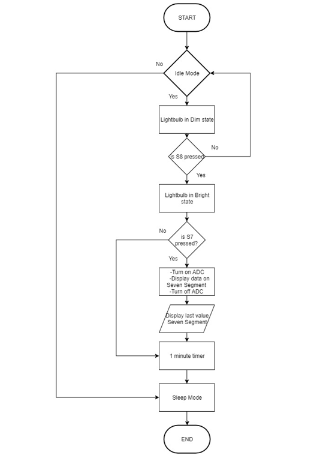
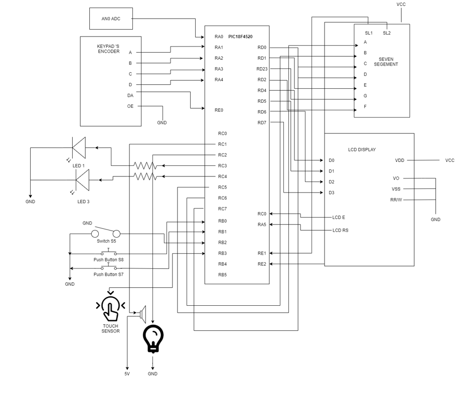

# Home_Automation_System_Advanced
This program was designed and developed in **C language** using PIC18F4520 microchip. 

##Note
This programe is a advanced continuation of the home automation system. 
Where techniques such as Pulse-Width Modulation (PWM), Analog to Digital Converter and power management is being utilised and integrated to the system.

## Project Objectives
Mr. Tan is running his own company specializing in home automation. You have been approached by Mr. Tan to develop an embedded prototype for introducing new IoT technology to implement SMART sustainable home solutions. The prototype shall eventually provide useful attributes to the management team for introducing new products.
The objectives of the project are to utilize interrupt, timer, pulse width modulation, analog to digital converter and power management to the PIC18F4520 microchip and provide a viable solution for the problem.

## System Operation
The system will be initial set on a sleep mode when there is no activity after a period of time.
During its operating mode, the light bulb brightness will be set to be fully lit up. Also, users will be able to adjust using potentiometer of the value and display it on the seven-segment display 
to simulate the air conditioner. If there is no changes or activity occurring in the system, the system will be set on idling mode, where the lightbulb brightness will be dimmer.
And after some time had passed speaker will sound to signal system entering sleep mode. The system will enter to a sleep mode.

### Project Conclusion
Our project is to implement SMART sustainable home solutions. We were able to integrate the interrupt, timer, pulse width modulation, analog to digital converter and power 
management to the PIC18F4520 microchip to design a smart home system that use energy saving features such as sleep and idle to save power, control the air conditioning with a knob,
and turn on and control the brightness of the bulb with pulse width modulation.

This project was completed in *08/02/2020* alongside with my team memember

POH BOON HOE KELVIN 
LIAN EXELBERT ANIER TAN 
YONG XUE HAN 
NG KAI SIEN RYANN 

## Flowchart Diagram of the System

## Schematic Diagram of the System

